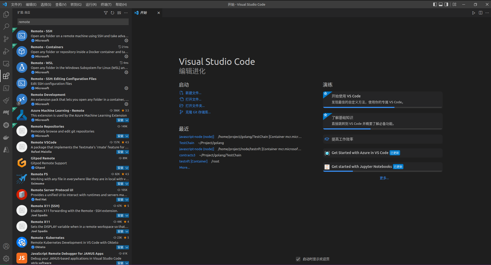

# 2、Solidity开发环境准备

Created: June 7, 2022 1:19 PM
Tags: Dev Container, Docker

在上一篇文章中我们已经准备好了用于开发、测试和部署智能合约的以太坊私有环境，那么在开始编写合约之前，我们还需要准备开发环境。出于个人习惯我使用VSCode，利用VSCode Remote插件以及Microsoft Development Container Images，可以非常方便的打造各种开发环境。另外操作系统的版本，以及Docker和VSCode的安装文档链接都放在了下面的表格里：

环境准备

| Ubuntu | 20.04LTS |
| --- | --- |
| Docker | https://docs.docker.com/engine/install/ubuntu/ |
| VS Code | https://code.visualstudio.com/docs/setup/linux |

### 准备Docker开发环境

因为我的系统是Ubuntu，所以就以Linux系统为例了。首先新建镜像的编译目录，并新建一个Dockerfile文件

```bash
~ $ mkdir devcontainer
~ $ cd devcontainer
~/devcontainer $ touch Dockerfile
```

复制下面的内容并粘贴到Dockerfile里，其中base image就是Microsoft Development Container Images，已经基于很多开发语言build了各种镜像，比如：cpp、dotnet、go、java、jsnode、php、python等等，可以在[DockerHub](https://hub.docker.com/_/microsoft-vscode-devcontainers)中找到详细的说明，其余就是需要用到的依赖库。

```docker
FROM mcr.microsoft.com/vscode/devcontainers/javascript-node:latest as base

RUN apt-get update && \
    apt-get install --no-install-recommends -y \
        build-essential \
        curl && \
    rm -rf /var/lib/apt/lists/* && \
    rm -rf /etc/apt/sources.list.d/*

RUN mkdir -p /home/app
WORKDIR /home/app

RUN npm install --global web3 ethereumjs-testrpc ganache-cli truffle
```

之后build镜像，等待完成之后启动镜像

```bash
~/devcontainer $ docker build --tag devcontainer .
~/devcontainer $ docker run -idt --name dev devcontainer /bin/bash
```

### VS Code安装remote container插件

VSCode安装完成之后，就可以安装VSCode Remote插件。非常之简单，直接在插件搜索框中搜索remote，就可以看到Remote三件套:SSH、Containers、WSL。SSH和Containers就不多解释了，WSL是Windows Subsystem for Linux，如果操作系统是windows11可以直接开启WSL，通过windows docker desktop在WSL里启用docker，效果是完全一样的 



### Attach到容器

安装完插件之后，就可以看到romote图标，点击进去后切换到containers就可以看到运行中的镜像了，选中后鼠标右键Attach到镜像，就会开启一个新的vscode。这样整个开发环境就准备完成了

