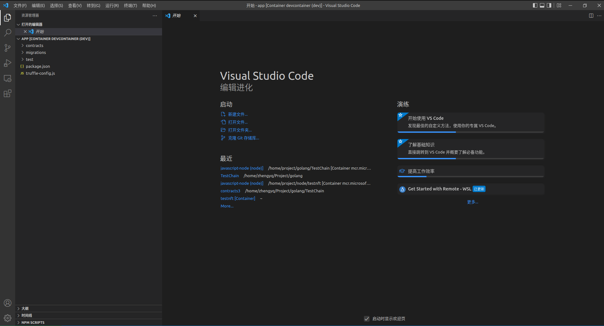

# 编写SmartContract

Created: June 7, 2022 3:01 PM
Tags: Ethereum, Smart Contract

### 初始化项目

```bash
~ $ mkdir app
~ $ cd app
~/app $ npm init -y
~/app $ truffle init
```

```bash
~/app $ tree
.
|-- contracts
|   `-- Migrations.sol
|-- migrations
|   `-- 1_initial_migration.js
|-- package.json
|-- test
`-- truffle-config.js

3 directories, 4 files
```

### VSCode中打开项目目录



### 安装Solidity扩展


### 新建.sol合约文件并安装依赖包

```bash
~/app $ touch contracts/TestNFT.sol
~/app $ npm install @openzeppelin/contracts
```

```bash
~/app $ tree -I "node_modules"
.
|-- contracts
|   |-- Migrations.sol
|   `-- TestNFT.sol
|-- migrations
|   `-- 1_initial_migration.js
|-- package-lock.json
|-- package.json
|-- test
`-- truffle-config.js

3 directories, 6 files
```

### 在VSCode中编写合约

```solidity
// SPDX-License-Identifier: UNLICENSED
pragma solidity >=0.4.22 <0.9.0;

import "@openzeppelin/contracts/token/ERC721/ERC721.sol";
import "@openzeppelin/contracts/access/Ownable.sol";
import "@openzeppelin/contracts/utils/Counters.sol";
import "@openzeppelin/contracts/token/ERC721/extensions/ERC721URIStorage.sol";

contract TestNFT is ERC721URIStorage, Ownable{

    using Counters for Counters.Counter;
    Counters.Counter private _tokenIds;

    mapping(uint => uint) public priceMap;

    event Minted(address indexed minter, uint price, uint nftID, string uri);
    constructor() ERC721("TestNFT", "NFT"){}

    function mintNFT(string memory _uri, address _toAddress, uint _price) public onlyOwner returns (uint256) {
        _tokenIds.increment();
        uint256 newItemId = _tokenIds.current();

        priceMap[newItemId] = _price;

        _safeMint(_toAddress, newItemId);
        _setTokenURI(newItemId, _uri);

        emit Minted(_toAddress, _price, newItemId, _uri);

        return newItemId;
    }
}
```

### 新建合约测试文件并安装依赖库

```solidity
~/app $ touch test/testnft_test.js
~/app $ npm install chai
~/app $ npm install bignumber.js
~/app $ npm install dotenv
~/app $ npm install @truffle/hdwallet-provider
~/app $ npm install @openzeppelin/test-environment
```

```solidity
~/app $ tree -I "node_modules"
.
|-- contracts
|   |-- Migrations.sol
|   `-- TestNFT.sol
|-- migrations
|   `-- 1_initial_migration.js
|-- package-lock.json
|-- package.json
|-- test
|   `-- testnft_test.js
`-- truffle-config.js

3 directories, 7 file
```

### 编写合约测试文件

```jsx
const { web3 } = require("@openzeppelin/test-environment");
const { expect } = require("chai");
const { BigNumber } = require("bignumber.js");

const TestNFTContract = artifacts.require("TestNFT");

contract("TestNFT", (accounts) => {

    describe("testnft", () => {
        beforeEach(async () => {
            this.contract = await TestNFTContract.new({ from: accounts[0] });
        });
    
        it("It should mint NFT successfully", async () => {
            const tokenURI = "ipfs://QmXzG9HN8Z4kFE2yHF81Vjb3xDYu53tqhRciktrt25JpAN";
        
            const mintResult = await this.contract.mintNFT(
              tokenURI,
              accounts[0],
              web3.utils.toWei("12", "ether"),
              { from: accounts[0] }
            );
            console.log(mintResult);
            const price = web3.utils.fromWei(
              new BigNumber(mintResult.logs[1].args.price).toString(),
              "ether"
            );
            expect(mintResult.logs[1].args.nftID.toNumber()).to.eq(1);
            expect(mintResult.logs[1].args.uri).to.eq(tokenURI);
            expect(mintResult.logs[1].args.minter).to.eq(accounts[0]);
            expect(price).to.eq("12");
        });
    });

    describe("owner()", () => {
        it("returns the address of the owner", async () => {
          const testntf = await TestNFTContract.deployed();
          const owner = await testntf.owner();
          assert(owner, "the current owner");
        });
    
        it("matches the address that originally deployed the contract", async () => {
          const testntf = await TestNFTContract.deployed();
          const owner = await testntf.owner();
          const expected = accounts[0];
          assert.equal(owner, expected, "matches address used to deploy contract");
        });
    });
});
```

### 修改truffle配置文件

合约在正式部署之前需要在我们之前建立的Azure Quorum测试环境中进行测试，truffle init在初始化项目的时候生成了一个配置文件：truffle-config.js，需要修改这个配置文件添加Quorum测试环境的网络配置。

```jsx
const HDWalletProvider = require("@truffle/hdwallet-provider");

module.exports = {

  networks: {
    development: {
      provider: () => new HDWalletProvider(mnemonic, `https://chain.azure-api.net/testrpc`),
      network_id: "1337",       // Quorum default network id 1337 (default: none)
    }
  },

  mocha: {},

  compilers: {
    solc: {
      version: "0.8.14",      // Fetch exact version from solc-bin (default: truffle's version)
    }
  },
};
```

### 运行测试

```bash
~/app $ truffle test --network development
```

```bash
Compiling your contracts...
===========================
> Compiling ./contracts/Migrations.sol
> Compiling ./contracts/TestNFT.sol
> Compiling @openzeppelin/contracts/token/ERC721/ERC721.sol
> Compiling @openzeppelin/contracts/token/ERC721/IERC721.sol
> Compiling @openzeppelin/contracts/token/ERC721/IERC721Receiver.sol
> Compiling @openzeppelin/contracts/token/ERC721/extensions/ERC721URIStorage.sol
> Compiling @openzeppelin/contracts/token/ERC721/extensions/IERC721Metadata.sol
> Compiling @openzeppelin/contracts/utils/Address.sol
> Compiling @openzeppelin/contracts/utils/Context.sol
> Compiling @openzeppelin/contracts/utils/Counters.sol
> Compiling @openzeppelin/contracts/utils/Strings.sol
> Compiling @openzeppelin/contracts/utils/introspection/ERC165.sol
> Compiling @openzeppelin/contracts/utils/introspection/IERC165.sol
> Artifacts written to /tmp/test--792396-qihnnT01oLfP
> Compiled successfully using:
   - solc: 0.8.14+commit.80d49f37.Emscripten.clang

  Contract: TestNFT
    testnft
      ✔ It should mint NFT successfully (9142ms)
    owner()
      ✔ returns the address of the owner (1069ms)
      ✔ matches the address that originally deployed the contract (1090ms)

  3 passing (21s)
```
