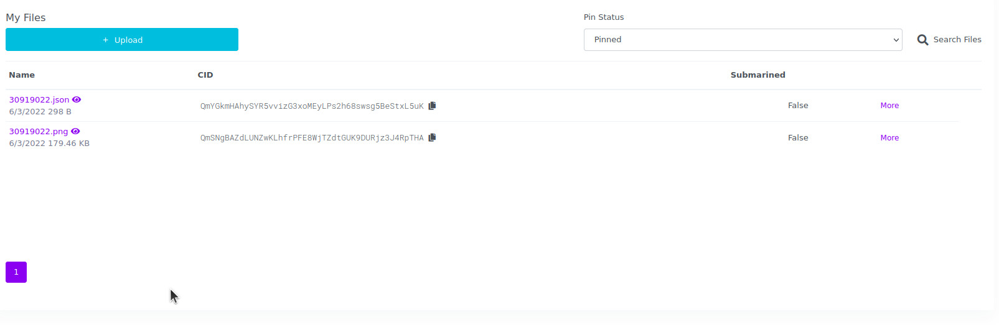

# 部署合约并发布NFT

Created: June 15, 2022 11:47 AM
Tags: IPFS, NFT

在发布NFT之前需要做一件事情，就是将一张图片上传到IPFS中。IPFS是一个分布式系统，用于存储和访问文件、网站、应用程序和数据，这有别于传统的文件存储，关于IPFS的内容，我们以后再讨论。目前互联网上有很多免费的IPFS服务提供商，比如：[Pinata](https://app.pinata.cloud/) 

### 准备制作NFT的图片

首先要准备一张图片，只要符合宽度在320和1080像素之间，长宽比在1.91:1和4:5之间的任何一张图片都可以。其次还要为这张图片制作一份Metadata文件，JSON格式如下：

```json
{
  "name": "your NFT name",
  "description": "your NFT description",
  "image": "ipfs://CID",
  "attributes": [
    {
      "trait_type": "attributes1",
      "value": "attributes1 value"
    },
    {
      "trait_type": "attributes2",
      "value": "attributes1 value"
    }
  ]
}
```

先上传图片到IPFS，以便获取图片的CID。然后将图片的CID填写到Metadata文件里。这样两个文件就准备齐了



### 修改truffle配置文件

在修改配置文件之前，先安装依赖包

```bash
~/app $ npm install @truffle/hdwallet-provider
```

还需要再添加一份配置文件

```bash
~/app $ touch .env
```

```bash
~/app $ tree -Ial "node_modules"
.
├── contracts
│   ├── Migrations.sol
│   └── TestNFT.sol
├── .env
├── migrations
│   └── 1_initial_migration.js
├── package.json
├── package-lock.json
├── test
│   └── testnft_test.js
└── truffle-config.js

3 directories, 8 files
```

我们需要在配置文件中写入私钥和公钥。这两个值在Quorum VM的目录中查找:

```
/home/quorum/quorum-test-network/smart_contracts/permissioning/scripts
```

```
ls -al
total 40
drwxrwxr-x 2 quorum quorum 4096 Jun 13 12:19 .
drwxrwxr-x 4 quorum quorum 4096 Jun 13 12:19 ..
-rwxrwxr-x 1 quorum quorum  141 Jun 13 12:19 compile.sh
-rwxrwxr-x 1 quorum quorum  178 Jun 13 12:19 copyAndRestart.sh
-rw-rw-r-- 1 quorum quorum 5123 Jun 13 12:19 deploy.js
-rw-rw-r-- 1 quorum quorum 2219 Jun 13 12:19 deployEthers.js
-rw-rw-r-- 1 quorum quorum 3602 Jun 13 12:19 keys.js
-rw-rw-r-- 1 quorum quorum 5183 Jun 13 12:19 readme.md
```

在keys.js中可以找到3个accounts，任选一个：

```bash
module.exports = {
  quorum: {
		validator*: {}
		rpcnode: {}
		member*: {}
		accounts: {
    "0xfe3b557e8fb62b89f4916b721be55ceb828dbd73" : {
      "privateKey" : "0x8f2a55949038a9610f50fb23b5883af3b4ecb3c3bb792cbcefbd1542c692be63",
    },
    "0x627306090abaB3A6e1400e9345bC60c78a8BEf57" : {
      "privateKey" : "0xc87509a1c067bbde78beb793e6fa76530b6382a4c0241e5e4a9ec0a0f44dc0d3",
      },
    "0xf17f52151EbEF6C7334FAD080c5704D77216b732" : {
      "privateKey" : "0xae6ae8e5ccbfb04590405997ee2d52d2b330726137b875053c36d94e974d162f",
      },
    }
};
```

以下就是整个配置文件

```
MNEMONIC = "c87509a1c067bbde78beb793e6fa76530b6382a4c0241e5e4a9ec0a0f44dc0d3"
API_URL = "https://chain.azure-api.net/testrpc"
PRIVATE_KEY = "c87509a1c067bbde78beb793e6fa76530b6382a4c0241e5e4a9ec0a0f44dc0d3"
PUBLIC_KEY = "0x627306090abaB3A6e1400e9345bC60c78a8BEf57"
```

再次修改truffle配置文件，这次我们需要加上用于部署合约的配置，provider的地址就是我们之前部署在Azure API Management的API地址：https://chain.azure-api.net/testrpc

```json
require("dotenv").config();
const HDWalletProvider = require("@truffle/hdwallet-provider");
const mnemonic = process.env.MNEMONIC;

module.exports = {

  networks: {
    development: {
      provider: () => new HDWalletProvider(mnemonic, `https://chain.azure-api.net/testrpc`),
      network_id: "1337",       // Quorum default network id 1337 (default: none)
    },
    polygon_testnet: {
      provider: () => new HDWalletProvider(mnemonic, `https://chain.azure-api.net/testrpc`),
      network_id: 1337,
      networkCheckTimeout: 9999,
      confirmations: 4,
      timeoutBlocks: 200,
      skipDryRun: true,
    }
  },

  mocha: {},

  compilers: {
    solc: {
      version: "0.8.14",      // Fetch exact version from solc-bin (default: truffle's version)
    }
  },
};
```

部署合约，当部署成功后我们会看到合约地址

```bash
~/app $ truffle migrate --network polygon_testnet
Compiling your contracts...
===========================
> Everything is up to date, there is nothing to compile.

Starting migrations...
======================
> Network name:    'polygon_testnet'
> Network id:      1337
> Block gas limit: 700000000 (0x29b92700)

1_initial_migration.js
======================

   Deploying 'Migrations'
   ----------------------
   > transaction hash:    0x12390dd2093089ebd304e16835173556d419bf876d051b2fdfb66a1ee2d10e7a
   > Blocks: 1            Seconds: 9
   > contract address:    0x68249ac64729F5e29f296ac0a670BDf9F6E6BeF9
   > block number:        13236
   > block timestamp:     1655274384
   > account:             0xf0E2Db6C8dC6c681bB5D6aD121A107f300e9B2b5
   > balance:             1000000000
   > gas used:            290582 (0x46f16)
   > gas price:           0 gwei
   > value sent:          0 ETH
   > total cost:          0 ETH

   Pausing for 4 confirmations...

   -------------------------------
   > confirmation number: 1 (block: 13237)
   > confirmation number: 2 (block: 13238)
   > confirmation number: 3 (block: 13239)
   > confirmation number: 4 (block: 13240)
   > Saving migration to chain.
   > Saving artifacts
   -------------------------------------
   > Total cost:                   0 ETH

Summary
=======
> Total deployments:   1
> Final cost:          0 ETH
```

### 发布NFT

先安装依赖包

```bash
~/app $ npm install @alch/alchemy-web3
```

新建一个JS文件，用来编写发布NFT的方法。我们还发现在部署合约的时候自动创建了一个build文件夹，这个是其实合约的编译目录。

```bash
~/app $ touch mint-nft.js
```

```bash
~/app $ tree -Ial "node_modules"
.
├── build
│   └── contracts
│       ├── Address.json
│       ├── Context.json
│       ├── Counters.json
│       ├── ERC165.json
│       ├── ERC721.json
│       ├── ERC721URIStorage.json
│       ├── IERC165.json
│       ├── IERC721.json
│       ├── IERC721Metadata.json
│       ├── IERC721Receiver.json
│       ├── Migrations.json
│       ├── Ownable.json
│       ├── Strings.json
│       └── TestNFT.json
├── contracts
│   ├── Migrations.sol
│   └── TestNFT.sol
├── .env
├── migrations
│   └── 1_initial_migration.js
├── mint-nft.js
├── package.json
├── package-lock.json
├── test
│   └── testnft_test.js
└── truffle-config.js

5 directories, 23 files
```

需要将之前部署合约后拿到的地址填写到发布代码中

```jsx
require('dotenv').config();
const API_URL = process.env.API_URL;
const PUBLIC_KEY = process.env.PUBLIC_KEY;
const PRIVATE_KEY = process.env.PRIVATE_KEY;

const { createAlchemyWeb3 } = require("@alch/alchemy-web3");
const web3 = createAlchemyWeb3(API_URL);

const contract = require("./build/contracts/TestNFT.json");
const contractAddress = "0x68249ac64729F5e29f296ac0a670BDf9F6E6BeF9";
const nftContract = new web3.eth.Contract(contract.abi, contractAddress);

async function mintNFT(tokenURI) {
    const nonce = await web3.eth.getTransactionCount(PUBLIC_KEY, 'latest'); //get latest nonce

    //the transaction
    const tx = {
        'from': PUBLIC_KEY,
        'to': contractAddress,
        'nonce': nonce,
        'gas': 500000,
        'data': nftContract.methods.mintNFT(tokenURI, PUBLIC_KEY, web3.utils.toWei("12", "ether")).encodeABI()
    };

    const signPromise = web3.eth.accounts.signTransaction(tx, PRIVATE_KEY)

    signPromise.then((signedTx) => {
      web3.eth.sendSignedTransaction(
        signedTx.rawTransaction,
        function (err, hash) {
            if (!err) {
                console.log(
                "The hash of your transaction is: ",
                hash,
                "\nCheck Alchemy's Mempool to view the status of your transaction!"
                )
            } else {
                console.log( "Something went wrong when submitting your transaction:",err)
            }
        })
    })
    .catch((err) => {
      console.log(" Promise failed:", err)
    })
}

mintNFT("ipfs://QmYGkmHAhySYR5vvizG4xoMEyLPs4h68swsg5BeStxL6uK")
```

执行代码，发布NFT

```bash
~/app $ node mint-nft.js
The hash of your transaction is:  0x04e22aace4a65f96c913441b8851ae855ae01cc48b023696f69805fcd1bea5d9 
Check Alchemy's Mempool to view the status of your transaction!
```

将NFT加载到钱包中

在部署测试环境的最后我们已经将测试环境添加到了MetaMask中，我们还需要将部署合约所用的账户导入MetaMask，并在账户的收藏品中导入NFT，合约地址是部署合约时返回的地址，ID号默认从1开始，导入后就可以在钱包中看到收藏品了

<div align=center >


</div>