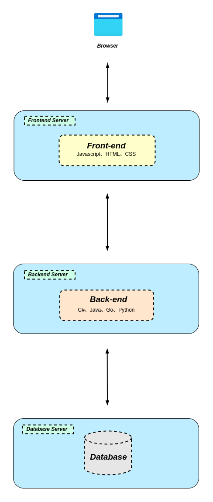
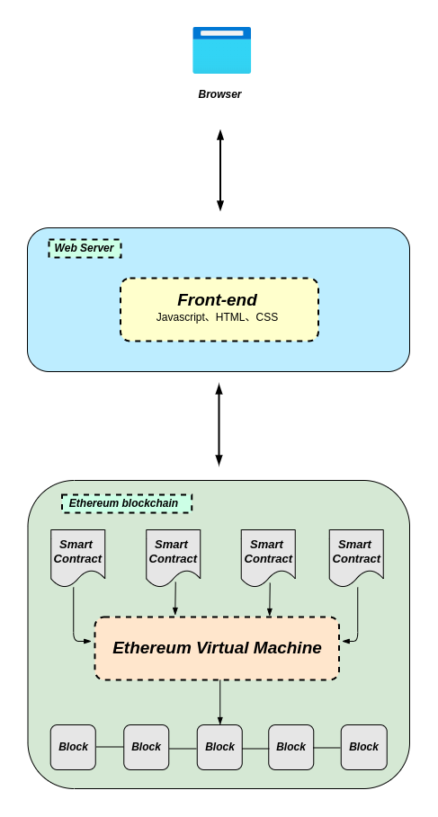
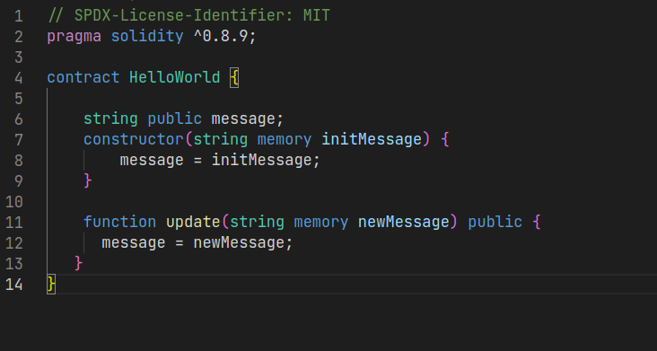
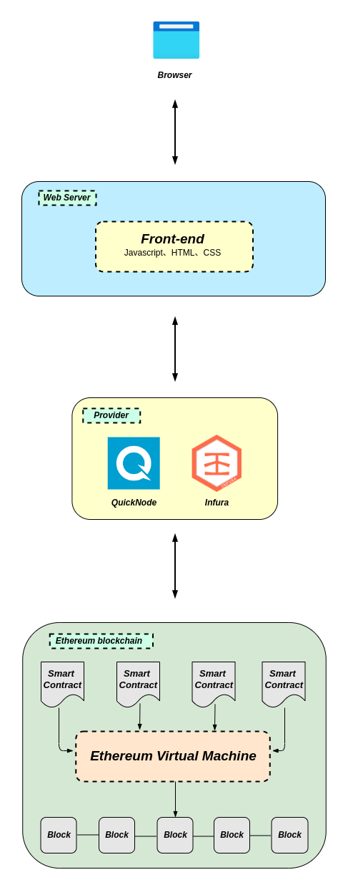
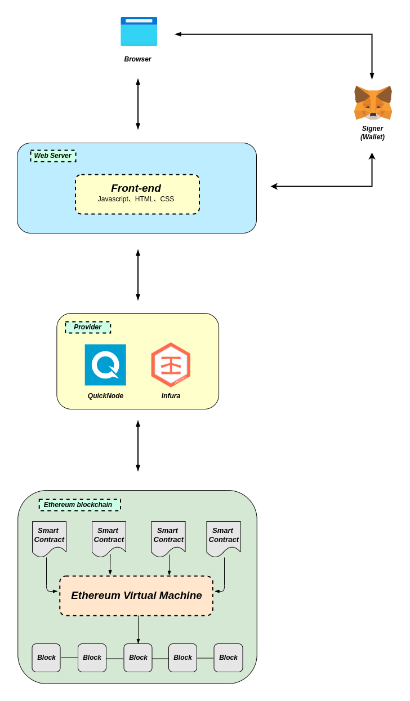

### Web 3.0 应用程序的架构

先说个结论：Web3应用程序（或DApps）的架构与Web2应用程序完全不同。

我们以一个简单的博客网站为例，让用户发布自己的内容并与他人的内容互动。作为一个 web2应用程序，大概的架构是这样的：

- **首先**：必须有一个地方来存储基本数据，如用户、帖子、标签、评论等等。这需要一个不断更新的数据库
- **其次**：后端代码（用C#、Java、Go或Python等语言编写）必须定义博客的业务逻辑。例如，当一个新用户注册、发表新博客或在别人的博客上发表评论时会发生什么？
- **最后**：前端代码（通常用JavaScript、HTML和CSS编写）必须定义博客的用户界面逻辑。例如，网站是什么样子的，当用户与页面上的每个元素互动时，会发生什么？

我们把这一切放在一起，当你在博客上写一篇文章时，你与它的前端互动，它与它的后端对话，后端再与它的数据库对话。所有这些代码都托管在集中式服务器上，并通过互联网浏览器发送给用户。这是对当今大多数Web 2.0应用如何工作的一个很好的总结。

但所有这一切都在改变。区块链技术为Web3.0应用解锁了一个令人兴奋的新方向。所以我们将重点讨论以太坊区块链带来的新变化。

### 是什么让Web 3.0与众不同？

与像微博这样的 Web 2.0 应用程序不同，Web 3.0 消除了中间人。没有储存应用状态的中央数据库，也没有储存后端逻辑的中央 Web 服务器。相反，您可以利用区块链在由互联网上匿名节点维护的分布式状态机上构建应用程序。

"状态机"是指维护某个给定程序状态和允许在该机器上的未来状态的机器。区块链是以某些初始状态实例化的状态机，并且具有非常严格的规则（即共识），定义了如何转换该状态。更好的是，没有单个实体控制这个分布式状态机——它由网络中的所有人共同维护。

那后端服务器呢？Web 3.0 中，您可以编写定义应用程序逻辑的智能合约，并将它们部署到分布式状态机上，而不是像 Medium 的后端一样由单个实体控制。这意味着每个想要构建区块链应用程序的人都会在这个共享状态机上部署他们的代码。

前端呢？基本上保持不变，有一些例外情况，我们将在稍后讨论。

这是架构的样子：

### 思考一些问题

现在，让我们更深入地了解使这一切成为可能的原因。

1、区块链（Blockchain） 以太坊区块链通常被吹捧为“世界计算机”。这是因为它是一台由点对点网络的节点维护的、全球可访问的、确定性的状态机。该状态机上的状态变化由网络中的节点遵循的共识规则管理。换句话说，它被设计为世界上任何人都可以访问和写入的状态机。原因是这台机器不属于任何单一实体，而是由网络中的所有人共同拥有。还有一件事要知道：数据只能被写入以太坊区块链，而你永远不能更新现有的数据。

2、智能合约（Smart contracts）   智能合约是在以太坊区块链上运行的程序，它定义了区块链上发生的状态变化背后的逻辑。智能合约使用高级语言（例如 Solidity 或 Vyper）编写。由于智能合约代码存储在以太坊区块链上，因此任何人都可以检查网络上所有智能合约的应用程序逻辑。

3、Ethereum Virtual Machine（EVM） 接下来是以太坊虚拟机，它执行智能合约中定义的逻辑，并处理全局可访问的状态机上发生的状态更改。但是EVM不理解像 Solidity 和 Vyper 这样的高级语言，这些语言用于编写智能合约。相反，你必须将高级语言编译成字节码，然后 EVM 才能执行它。

4、Front-end 最后是前端。正如我们之前提到的，它定义了 UI 逻辑，但前端也与智能合约中定义的应用逻辑进行通信。

前端与智能合约之间的通信比上图中看起来要复杂一些。下面我们来仔细看看。

### 前端代码如何与以太坊上的智能合约进行通信？

我们希望前端能够与智能合约进行通信，以便调用函数，但要记住，以太坊是一个去中心化的网络。以太坊网络中的每个节点都保留了以太坊状态机上所有状态的副本，包括与每个智能合约相关的代码和数据。

当我们希望与区块链上的数据和代码进行交互时，我们需要与其中一个节点进行交互。这是因为任何节点都可以广播要求在 EVM 上执行事务的请求。矿工将执行事务，并将结果状态更改传播到网络的其余部分。

有两种方法可以广播一个新的交易： 1、设置自己的节点，运行以太坊区块链软件 2、使用Infura、Alchemy和Quicknode等第三方服务提供的节点 

如果使用第三方服务，就不必自己处理运行完整节点的所有问题。毕竟，在自己的服务器上设置新的以太坊节点可能需要几天时间（有很多数据要同步，甚至可能比典型的笔记本电脑所能承受的带宽和存储更大）。

也就是说，为了避免这些麻烦，许多 DApp 选择使用 Infura 或 Alchemy 等服务来管理他们的节点基础设施。当然，这就存在一个权衡，因为这会创建一个集中式的瓶颈，但我们把这个问题留给另一天再讨论吧。

接下来，让我们来谈谈提供商。当你需要与区块链交互时（无论你是自己设置还是使用第三方服务的现有节点）连接的节点通常被称为“提供商”。

每个 Ethereum 客户端（即提供商）都实现了 JSON-RPC 规范。这确保了当前端应用程序希望与区块链交互时有一组统一的方法。如果你需要了解 JSON-RPC 的基础知识，它是一种无状态、轻量级的远程过程调用（RPC）协议，它定义了几种数据结构以及处理这些数据结构的规则。它是与传输无关的，因此这些概念可以在同一进程内使用，也可以通过套接字、HTTP 或许多各种消息传递环境使用。它使用 JSON（RFC 4627）作为数据格式。

一旦你通过提供商连接到区块链，就可以读取存储在区块链上的状态。但是，如果你想要写入状态，在将事务提交到区块链之前，你还需要做一件事，使用你的私钥“签署”事务。

例如，想象一下我们有一个 DApp，它允许用户读取或将博客文章发布到区块链上。你可能在前端有一个按钮，允许任何人查询某个特定用户写的博客文章。（记住，从区块链中读取不需要用户签署事务。）

这种“签署”事务通常是 Metamask 发挥作用的地方。

Metamask 是一个工具，使应用程序能够轻松处理密钥管理和事务签名。它很简单：Metamask 在浏览器中存储用户的私钥，并且每当前端需要用户签署事务时，它就会调用 Metamask。此外，Metamask 还提供了与区块链的连接（作为“提供商”），这是因为它已经与 Infura 提供的节点连接了起来，并且它需要它来签署事务。这样，Metamask 既是提供商又是签名者。